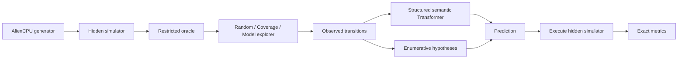

# MachineZero

**Learning to understand computers never seen before.**

MachineZero is an open research prototype that studies whether a model can understand a previously unseen computational system by actively experimenting with it.

Instead of training on a fixed ISA such as x86 or ARM, MachineZero trains and evaluates across procedurally generated CPUs whose instruction semantics change between architectures. At test time, the system receives a brand-new hidden architecture, a limited experiment budget, and must learn enough of its rules to predict unseen behavior.

> It isn't learning an ISA. It's learning how to learn one.

```text
Unknown CPU
    ↓
choose experiment
    ↓
observe transition
    ↓
update machine model
    ↓
predict unseen program
    ↓
execute to verify
```

## Overview

The core benchmark is **AlienCPU**, a deterministic generator for synthetic CPUs with randomized opcode assignments, word width, register count, instruction subsets, operand ordering, and flag behavior. Ground-truth semantics remain inside the simulator; discovery code sees only black-box transitions.

The repository contains three complementary reasoning paths:

- a **1,182,064-parameter structured semantic Transformer** trained across procedurally generated architectures;
- a transparent **enumerative system-identification baseline** that removes hypotheses inconsistent with observed experiments;
- three experiment selectors: **RandomExplorer**, **CoverageExplorer**, and a learned **ModelExplorer** based on predictive semantic uncertainty.

The strongest deterministic demo currently uses the transparent system-identification path. The learned model is evaluated separately and now shows a clear improvement as informative context becomes available.

## Why this exists

Instruction semantic inference, active system identification, neural execution, meta-learning, and reverse engineering already have substantial prior work. MachineZero focuses on a controlled question:

**Can a learner generalize across architectures whose semantics are permuted, actively probe a new machine, and improve under a strict interaction budget?**

Synthetic architectures make that question measurable because the benchmark has complete hidden ground truth while still enforcing executable train/test isolation.

## How AlienCPU works

Each architecture is reproducible from a seed. Current randomized dimensions include:

- 8, 12, or 16-bit words;
- 4-8 registers;
- 8-13 opaque opcode assignments;
- operation subsets drawn from arithmetic, Boolean, shifts, immediate loads, compare, and branches;
- operand direction;
- zero/carry flag behavior.

The same opcode byte has no global meaning. For example, `0x17` may be `ADD` on one generated machine and `XOR` or `MOV` on another.

The restricted discovery interface exposes only black-box execution:

```python
observation = oracle.execute(initial_state, instruction)
```

It does not expose the architecture seed, architecture ID, opcode table, or hidden semantic labels.

## 30-second example

```bash
machinezero generate --seed 2026
machinezero discover --seed 2026 --budget 20 --explorer coverage
machinezero predict examples/programs/test.mz --seed 2026 --budget 20
```

For debugging only, ground truth can be revealed explicitly:

```bash
machinezero inspect --seed 2026 --reveal
```

## Architecture



See [`docs/architecture.md`](docs/architecture.md) for the full data flow.

## Quick start

MachineZero requires Python 3.11+.

```bash
python3.12 -m venv .venv
source .venv/bin/activate
python -m pip install --upgrade pip
python -m pip install -e '.[dev]'
pytest -q
machinezero generate --seed 42
```

If developing without an editable install, prefix commands with `PYTHONPATH=src`.

## Training

The small reproducible configuration uses **48 training architectures, 8 validation architectures, and 8 completely held-out test architectures**.

```bash
python -m machinezero.training.train \
  --data-config configs/data/small.yaml \
  --model-config configs/model/small.yaml \
  --train-config configs/train/default.yaml \
  --out checkpoints/model.pt
```

The current model predicts a latent opcode hypothesis rather than 130 independent output bits. It learns:

```text
operation family
operand direction
zero-flag update behavior
carry-flag update behavior
```

and then executes that inferred hypothesis to produce a concrete next state.

The representation includes architecture-independent **observable candidate-consistency features** derived only from black-box transitions. They encode whether generic operation hypotheses are compatible with what was observed; they do not read the hidden ISA specification.

The captured small CPU run trained **1,182,064 parameters** and reduced semantic loss from **1.669392 to 0.408398** over four epochs.

## Evaluation

Learned model:

```bash
python -m machinezero.evaluation.evaluate \
  --checkpoint checkpoints/model.pt \
  --queries-per-arch 40 \
  --out results/eval.json
```

Model-informed active exploration:

```bash
python -m machinezero.evaluation.evaluate \
  --checkpoint checkpoints/model.pt \
  --active \
  --out results/active_eval.json
```

System-identification baseline:

```bash
python -m machinezero.evaluation.system_id_eval \
  --out results/system_id_eval.json
```

Simple baselines:

```bash
python -m machinezero.evaluation.baseline_eval \
  --out results/baselines.json
```

All reported test CPUs are held out at the **architecture level**. Predictions are verified by executing the hidden simulator; there is no LLM judge.

## CUDA acceleration

`BatchedAlienCPU` evaluates many transitions in parallel with PyTorch tensors and automatically supports CUDA when available. CPU and CUDA parity is tested when a GPU exists.

```bash
python benchmarks/benchmark_simulator.py --n 20000
```

On the CPU-only machine used for the captured run:

- scalar Python: **1.00M transitions/s**;
- batched PyTorch CPU: **11.64M transitions/s**;
- CUDA: unavailable in that environment, so no GPU number is reported.

Throughput is measured at runtime and written to `results/benchmark.json`; it is not hardcoded by the benchmark.

## Results

### Learned model on 8 held-out architectures

The primary learned evaluation uses **320 held-out query transitions per budget point**.

| Explorer | Budget | Exact state | Register accuracy | Operation accuracy |
|---|---:|---:|---:|---:|
| Coverage | 0 | 15.9% | 83.8% | 14.4% |
| Coverage | 2 | 27.5% | 86.7% | 33.1% |
| Coverage | 5 | 30.6% | 88.0% | 40.0% |
| Coverage | 10 | 59.4% | 96.1% | 69.4% |
| Coverage | 20 | **66.6%** | **97.5%** | **81.6%** |
| Coverage | 30 | 65.0% | 97.1% | 75.0% |

The budget-0 row is the learned **no-context** baseline. Accuracy rises sharply once coverage probing has exposed most queried opcodes. The slight budget-30 regression is reported as measured rather than smoothed away; the current context aggregation was trained with shorter contexts and remains a research limitation.

In the captured smaller active-explorer run (**96 queries per budget point**), ModelExplorer reached **37.5% exact at budget 5**, **56.3% at 10**, and **66.7% at 20**. Coverage reached 32.3%, 63.5%, and 64.6% at the same budgets in that run. This is evidence that model-informed selection can be competitive, not a claim that it universally dominates coverage.

### Transparent system-identification baseline

Using **320 held-out queries per budget point**:

| Explorer | Budget | Exact state | Register accuracy |
|---|---:|---:|---:|
| Random | 0 | 16.9% | 86.2% |
| Random | 10 | 50.3% | 94.5% |
| Random | 20 | 80.9% | 97.9% |
| Random | 30 | 88.4% | 99.4% |
| Coverage | 10 | 50.9% | 96.5% |
| Coverage | 20 | **90.0%** | **99.6%** |
| Coverage | 30 | **94.1%** | **99.6%** |

This baseline is deliberately explicit and interpretable. Its role is to prove that the generated machines are identifiable under a small interaction budget and to provide a strong reference while the learned meta-model improves.

### Simple baselines

Across 320 held-out transitions:

- random-state predictor: **0.0% exact**;
- no-op predictor: **20.6% exact**.

Raw measured artifacts live under [`results/`](results/).

## Repository map

- `src/machinezero/aliencpu/` - architecture generation, scalar simulator, batched simulator, restricted oracle
- `src/machinezero/data/` - architecture splits, procedural dataset, structured encoding
- `src/machinezero/models/` - learned Transformer, prediction executor, baselines, system identifier
- `src/machinezero/discovery/` - random, coverage, and learned experiment selection
- `src/machinezero/evaluation/` - executable metrics and held-out evaluation
- `configs/` - reproducible data/model/training settings
- `benchmarks/` - scalar/PyTorch CPU/CUDA throughput benchmark
- `demo/` - deterministic contest demo
- `examples/programs/` - fixed-width `.mz` examples
- `tests/` - generator, simulator, split, model, encoding, prediction, and discovery tests

## Reproduce the MVP

To run the complete small pipeline from the repository root:

```bash
./scripts/reproduce_mvp.sh
```

That script runs:

```text
pytest
→ train learned model
→ evaluate learned budget curves
→ evaluate simple baselines
→ evaluate system-identification curves
→ benchmark simulator
→ run deterministic seed-2026 demo
```

Every generated result is written under `results/`.

## Research questions

1. How much interaction is required to identify a novel computational system?
2. Which experiment-selection strategies maximize information per query?
3. Can learned context models approach or exceed explicit hypothesis enumeration as architectures become richer?
4. How does generalization degrade under new word widths, register counts, flags, or operation families?
5. Which inductive biases preserve architecture independence while making modular machine semantics learnable?

## Limitations

The MVP intentionally keeps instructions fixed-width and omits memory. The learned model still underperforms explicit hypothesis enumeration and is less stable with contexts longer than those seen during training. ModelExplorer is a simple entropy-plus-novelty policy, not an optimized active-learning algorithm. Program synthesis/goal solving is not implemented. CUDA support exists, but the captured benchmark machine had no CUDA device, so no GPU throughput is claimed.

## Related work

Relevant areas include active system identification, instruction semantic inference, neural program execution, meta-learning, and reverse engineering. Precise citations should be added only after verification; this repository deliberately avoids fabricated references or sweeping novelty claims.

MachineZero's intended differentiation is narrower:

**cross-architecture meta-learning and active experimental discovery over procedurally generated computational systems with executable hidden ground truth.**

## Citation

See [`CITATION.cff`](CITATION.cff).

## License

Apache License 2.0. See [`LICENSE`](LICENSE).
