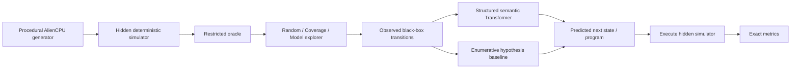

# System architecture

MachineZero separates **world generation**, **hidden execution**, **discovery**, **prediction**, and **verification**.

1. `generate_architecture(seed)` creates a complete immutable ISA specification.
2. `AlienCPU` executes that specification deterministically.
3. `HiddenOracle` wraps the simulator and exposes only public machine dimensions, valid opaque opcode bytes, and black-box `execute` calls.
4. An `Explorer` selects experiments under a hard interaction budget.
5. A predictor consumes observed `(before, instruction, after)` transitions plus a new query.
6. Evaluation predicts behavior without simulator access, then executes the same query on the hidden simulator and computes exact metrics.

Architecture IDs are hashes of generated specifications for reproducibility. They are metadata only and are never model features.

## Learned path

The learned path first infers latent opcode semantics from experiment context. Architecture-independent observable consistency features provide an inductive bias for arithmetic/system-identification structure; they do not reveal the generated ISA. The inferred semantics are executed by a generic predictor to produce a concrete machine state.

## Explicit system-identification path

The enumerative baseline keeps every generic semantic hypothesis consistent with black-box observations. Coverage probes are designed to collapse this hypothesis set quickly. This path provides the strongest current deterministic demo and a transparent sanity check on benchmark learnability.

## GPU path

`BatchedAlienCPU` implements transition simulation with PyTorch tensors. The same implementation runs on CPU or CUDA. The scalar simulator remains the semantic reference, and parity tests compare batched execution against it. CUDA-specific tests skip automatically when no GPU is present.
